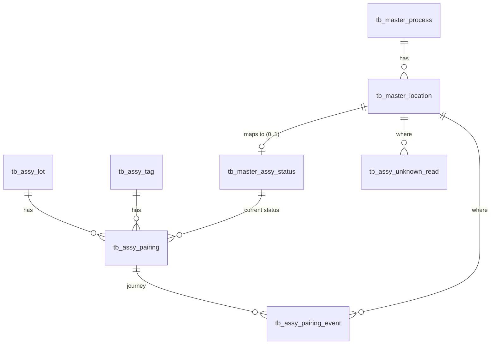

# Backend Redesign — Lot / Tag Journey (Design Spec)

- Date: 2026-10-01
- Branch: `ayt-rfid`
- Status: **Draft v2 — waiting for review**
- Scope: branches B0–B5 (see section 2). B6 and B7 get their own short specs later.

---

## 1. Goal

Rebuild the backend data model and flow from zero.

- One source of truth for: "which tag is on this lot now, and where is it".
- Full journey of every lot: every pair, scan and clear.
- A new process or location later = new master rows, not a schema change.
- All business rules in Node services (route → controller → service → repository). No stored procedures.

Context: the old flow never ran in production. Old tables and SPs are already dropped from the dev DB. There is no data to migrate.

### Out of scope (this spec)

- Roles / auth. `emp_id` comes from the request body (see Risks R1).
- Reader service (the program that talks to the RFID readers). We only define the scan endpoint it will call.
- Frontend changes. FE moves to the new API in B7. Until then, FE runs in mock mode.
- Users / login / API log refactor into the new layers (B6).

---

## 2. Branches

| # | Branch | Duty | Status |
| --- | --- | --- | --- |
| B0 | Foundation | Folder layout, error handling, validation, app/server split, test helpers. Removes the old polling in `server.js` (it queries tables that no longer exist); B4 adds the new job. | [ ] |
| B1 | Master data | Process, location, status. Admin CRUD. | [ ] |
| B2 | Register / pair | AS400 lot client, lot snapshot, tag auto-create, pair, tag retire | [ ] |
| B3 | Scan (journey) | Scan endpoint, rule "last scan wins", unknown reads | [ ] |
| B4 | Clear | Done API client, auto clear (job) + runbook, manual clear (web) | [ ] |
| B5 | Query / dashboard | Lot state, journey, events, dashboard, machine API client + cache | [ ] |
| B6 | Existing modules | Users / login / API log → new layers. No behavior change. | [-] DEFERRED — separate refactor after B0 |
| B7 | FE switch | FE screens move to the new endpoints; remove leftover old route code | [-] DEFERRED — FE work, own plan after B5 |

Build order: B0 → B1 → B2 → B3 → B4 → B5. One implementation plan per branch.
Each branch deletes the old route handlers in `backend/routes/assembly.js` that it replaces, in the same task. When B5 is done, the file is empty and gets deleted.

---

## 3. Decision log

All confirmed with you.

| # | Decision |
| --- | --- |
| D1 | Pairing is 1 lot ↔ 1 tag at a time. Tags are reused after the pair closes. |
| D2 | Status belongs to the **pairing**, not to lot or tag. Every change writes an event row. |
| D3 | Stage 1 "before register" is virtual. No row in our DB. |
| D4 | One location belongs to exactly one process. |
| D5 | Scan rule: **last scan wins**. Going back (4 → 3) is allowed. `seq` is display order only. |
| D6 | Duplicate read (same location as current status) → no event, only update `last_seen_at`. |
| D7 | Auto clear gate = external done API by `lot_no`. Found → clear. No status precondition. |
| D8 | Clear has two triggers: scheduled job (auto) and Clear Tag page (manual). |
| D9 | Done API is yes/no. Our event `created_at` is the clear time. |
| D10 | Lot is a snapshot of AS400 data: one row per `lot_no`. Raw response stays in `tb_assy_api_log`. |
| D11 | Tag is created on first pair. `is_active` retires a damaged tag. "Free" is derived, not stored. |
| D12 | A pair closes only one way: **CLEARED**. No `CANCELLED` status. A wrong pair is fixed by manual clear with a remark. |
| D13 | Re-pair is always allowed when the lot has no active pair. |
| D14 | Machine no.: live call to machine API + in-memory cache. One WOS → many machines. |
| D15 | State + log: `pairing.status_id` is the current state. `pairing_event` is append-only. Same transaction. |
| D16 | No stored procedures. Layers: route → controller → service → repository. |
| D17 | Manual clear is a **force** fallback for when auto clear can't finish. It does **not** call the done API. It needs: lot + tag are the active pair (checked in BE), `emp_id`, remark, and the pair's current process has `can_clear_tag = 1`. |
| D18 | `REGISTERED` maps to location **Before Gauging Room F1** (`bf_gr_f1`, process 1500). So every active status has a location and a process. |
| P2 | Table names keep the `tb_assy_` / `tb_master_` prefix. Old tables are already dropped, so the names are free. |
| P3 | API base stays `/api/assembly` with new resource paths. No `/v2`. |
| P4 | Feature folders: `modules/<feature>/{routes,controller,service,repository,schemas}.js`. |
| P5 | Request validation with **zod** at the route boundary. |
| P6 | Unknown-tag reads go to their own table, with a counter (one row per tag + location). |
| P7 | Pair always re-fetches the lot from AS400 in the BE. The client sends only `lot_no` + `tag_code` + `emp_id`. |
| P8 | Mock upstream APIs are routes in our backend (`/api/assembly/mock/...`), mounted only when `ENABLE_MOCK_ROUTES=true`. Dev env points the API URL env vars at them. This phase builds the business logic against mocks; real API integration comes later. |
| P9 | `can_clear_tag` on process stays. It gates manual clear (D17). Auto clear ignores it this phase. See Future F1. |
| P10 | All timestamps use DB time (`SYSDATETIME()`), `DATETIME2`. |

---

## 4. Lot lifecycle

```text
(1) BEFORE REGISTER  -- virtual, lot only in AS400
        |
        |  pair (web, at Before Gauging Room F1)
        v
(2) REGISTERED  <------>  (3) GR_F1  <------>  (4) MC_F1
        |       scan any location: last scan wins, any direction
        |                     |                     |
        +---------------------+---------------------+
                              |
                              |  clear:  auto (job, done API found the lot)
                              |       or manual (web, force, remark required)
                              v
                      (5) CLEARED (terminal)  -- lot can be paired again (D13)
```

- Active pair = `closed_at IS NULL`.
- Clear works from any active status (2, 3 or 4). Manual clear also needs `can_clear_tag` on that status's process.
- After a pair closes, the tag is free. A read of that tag becomes an "unknown read".
- The lot's displayed stage:
  - Has active pair → that pair's status.
  - No active pair → `CLEARED` (its latest pair).
  - Not in our DB → stage 1 (virtual).

---

## 5. Data model

### 5.1 ERD



### 5.2 Tables

#### `tb_master_process`

Same columns as before, recreated:

| Column | Type | Rule |
| --- | --- | --- |
| id | INT IDENTITY | PK |
| process_code | VARCHAR(10) | NOT NULL, UNIQUE |
| process_name | VARCHAR(50) | NOT NULL |
| can_clear_tag | BIT | NOT NULL, default 0. Gates manual clear (D17). |

Seed: `1500 GAUGING`, `can_clear_tag = 1`.

#### `tb_master_location`

| Column | Type | Rule |
| --- | --- | --- |
| id | INT IDENTITY | PK |
| location_code | VARCHAR(20) | NOT NULL, UNIQUE. Same value the reader sends (e.g. `gr_f1`). |
| location_name | VARCHAR(100) | NOT NULL |
| process_id | INT | NOT NULL, FK → `tb_master_process.id` (D4) |
| is_active | BIT | NOT NULL, default 1. Scans at an inactive location are rejected. |
| created_at | DATETIME2(0) | NOT NULL, default `SYSDATETIME()` |

Seed (all process `1500`):

| location_code | location_name |
| --- | --- |
| `bf_gr_f1` | Before Gauging Room F1 |
| `gr_f1` | Gauging Room F1 |
| `mc_f1` | MC Gauging F1 |

#### `tb_master_assy_status`

| Column | Type | Rule |
| --- | --- | --- |
| id | INT IDENTITY | PK |
| status_code | VARCHAR(30) | NOT NULL, UNIQUE. Code refers to statuses by code, never by id. |
| status_label | VARCHAR(50) | NOT NULL |
| seq | INT | NOT NULL. Display order only (D5). |
| location_id | INT NULL | FK → `tb_master_location.id`. Filtered UNIQUE `WHERE location_id IS NOT NULL` (one status per location). |
| is_terminal | BIT | NOT NULL, default 0. Terminal = closes the pair. |

CHECK: `(is_terminal = 1 AND location_id IS NULL) OR (is_terminal = 0 AND location_id IS NOT NULL)`.
Meaning: every active status has a location (D18), and a scan can never close a pair.

System statuses (seeded; the service blocks delete or a code change): `REGISTERED`, `CLEARED`.

Seed:

| seq | status_code | status_label | location | is_terminal |
| --- | --- | --- | --- | --- |
| 2 | REGISTERED | Registered | `bf_gr_f1` | 0 |
| 3 | GR_F1 | Gauging Room F1 | `gr_f1` | 0 |
| 4 | MC_F1 | MC Gauging F1 | `mc_f1` | 0 |
| 5 | CLEARED | Cleared | — | 1 |

#### `tb_assy_lot`

| Column | Type | Rule |
| --- | --- | --- |
| id | INT IDENTITY | PK |
| lot_no | VARCHAR(15) | NOT NULL, UNIQUE |
| wos | VARCHAR(20) | NULL. 20, not 10: the machine API sample has 12 chars (`HD-123123123`). |
| brg_type | VARCHAR(30) | NULL |
| spec | VARCHAR(20) | NULL |
| qty | INT | NULL |
| fetched_at | DATETIME2(0) | NOT NULL. Last AS400 fetch. |
| created_at | DATETIME2(0) | NOT NULL, default `SYSDATETIME()` |

Index: `IX_assy_lot_wos (wos)`.
Each new pair re-fetches from AS400 and updates the snapshot (P7).

#### `tb_assy_tag`

| Column | Type | Rule |
| --- | --- | --- |
| id | INT IDENTITY | PK |
| tag_code | VARCHAR(50) | NOT NULL, UNIQUE |
| is_active | BIT | NOT NULL, default 1 |
| created_at | DATETIME2(0) | NOT NULL, default `SYSDATETIME()` |

#### `tb_assy_pairing` (the "basket")

| Column | Type | Rule |
| --- | --- | --- |
| id | INT IDENTITY | PK |
| lot_id | INT | NOT NULL, FK → `tb_assy_lot.id` |
| tag_id | INT | NOT NULL, FK → `tb_assy_tag.id` |
| status_id | INT | NOT NULL, FK → `tb_master_assy_status.id` |
| paired_by | VARCHAR(10) | NOT NULL. emp_id. |
| paired_at | DATETIME2(0) | NOT NULL, default `SYSDATETIME()` |
| last_seen_at | DATETIME2(0) | NULL. Last reader read (D6). |
| closed_at | DATETIME2(0) | NULL. NULL = active. |
| closed_by | VARCHAR(10) | NULL. emp_id for manual clear, NULL for the job. |
| updated_at | DATETIME2(0) | NOT NULL, default `SYSDATETIME()` |

Indexes:

| Name | Columns | Purpose |
| --- | --- | --- |
| `UX_pairing_active_lot` | `(lot_id) WHERE closed_at IS NULL` | Max one active pair per lot (D1) |
| `UX_pairing_active_tag` | `(tag_id) WHERE closed_at IS NULL` | Max one active pair per tag (D1) |
| `IX_pairing_active_status` | `(status_id) INCLUDE (lot_id) WHERE closed_at IS NULL` | Dashboard counts |
| `IX_pairing_lot` | `(lot_id, paired_at)` | Journey per lot |

Rule (service): `closed_at` is set **if and only if** the new status is terminal. One repository function does both.

#### `tb_assy_pairing_event` (the journey, append-only)

| Column | Type | Rule |
| --- | --- | --- |
| id | BIGINT IDENTITY | PK |
| pairing_id | INT | NOT NULL, FK |
| event_type | VARCHAR(20) | NOT NULL. CHECK in (`PAIRED`, `SCANNED`, `CLEARED`) |
| from_status_id | INT NULL | FK. NULL for `PAIRED`. |
| to_status_id | INT | NOT NULL, FK |
| location_id | INT NULL | FK. Set for `PAIRED` (`bf_gr_f1`) and `SCANNED`. NULL for `CLEARED`. |
| source | VARCHAR(10) | NOT NULL. CHECK in (`web`, `reader`, `job`) |
| emp_id | VARCHAR(10) | NULL. NULL for `reader` and `job`. |
| remark | VARCHAR(255) | NULL. Required for manual clear (service rule). |
| created_at | DATETIME2(3) | NOT NULL, default `SYSDATETIME()` |

Indexes: `IX_event_pairing (pairing_id, created_at)`, `IX_event_created (created_at) INCLUDE (event_type, to_status_id)`.
No UPDATE or DELETE on this table, ever.

#### `tb_assy_unknown_read` (P6)

| Column | Type | Rule |
| --- | --- | --- |
| id | INT IDENTITY | PK |
| tag_code | VARCHAR(50) | NOT NULL |
| location_id | INT | NOT NULL, FK |
| first_seen_at | DATETIME2(0) | NOT NULL |
| last_seen_at | DATETIME2(0) | NOT NULL |
| read_count | INT | NOT NULL, default 1 |

UNIQUE `(tag_code, location_id)`. Upsert: UPDATE first; if 0 rows, INSERT; on duplicate-key error (2601/2627) retry the UPDATE once.

When it happens: a reader reads a tag with no active pair. For example, a tray goes in before it is registered, a tag stays on a tray after clear, or a foreign tag passes the reader.

#### Other tables (kept or recreated by their own modules)

- `tb_assy_api_log`: all external API calls are logged here (see 8.4).
- `tb_assy_login`: B6.
- `tb_assy_mock_as400`, `tb_assy_mock_done`: dev-only data behind the mock routes (P8).

### 5.3 SQL delivery

- Up: `backend/backup_DB_SP/create_assy_core.sql`. Down: `create_assy_core.down.sql`. Same pattern as `alter_process_can_clear_tag.sql`.
- Seed (process, locations, statuses) is in the up script.
- `backend/scripts/setup_dev_database.sql` gets the same tables + seed.
- You run all SQL yourself. I show the up/down SQL first and never run it.
- The down script drops the new tables. It needs your explicit OK each time it runs.
- Filtered indexes need `ANSI_NULLS ON` and `QUOTED_IDENTIFIER ON` on writing sessions. The `mssql` driver default is ON. The script header notes it.
- Old SP files in `backend/backup_DB_SP/dbo.*.sql` for tables that no longer exist get deleted from the repo in the branch that replaces them.

---

## 6. Backend structure (B0)

```text
backend/
  app.js                    express app: middleware, /api/assembly router, error handler. No listen().
  server.js                 listen() + start jobs
  db.js                     existing: query(), transaction(), typed()
  shared/
    AppError.js             AppError(code, httpStatus, message, details?)
    errorHandler.js         AppError → { error, message }; unknown → 500 INTERNAL (logged)
    validate.js             validate({ params, query, body }) middleware using zod
    sqlErrors.js            isUniqueViolation(err) → 2601 / 2627
  clients/
    as400Client.js          fetchLot(lotNo) → snapshot | null
    doneClient.js           isLotDone(lotNo) → boolean
    machineClient.js        listWosMachines() → [{ wos, mc_no, part_no, spec }], 60 s cache
    httpLogger.js           wraps an axios call + writes tb_assy_api_log
  modules/
    master/                 processes, locations, statuses
    pairing/                pair, clear, tag retire (service owns all state changes)
    scan/                   scan
    query/                  lots, journey, events, dashboard
    mock/                   mock upstream routes (P8)
  jobs/
    autoClearJob.js
```

Each module: `routes.js`, `controller.js`, `service.js`, `repository.js`, `schemas.js`.

| Layer | Does | Does not |
| --- | --- | --- |
| routes | path + `validate(schema)` + controller | logic |
| controller | read `req`, call service, send status + JSON | SQL, rules, try/catch for 500 |
| service | rules, transactions, call clients | `req` / `res`, raw SQL |
| repository | parameterized SQL via `db` / `txDb` | rules |

Rules:

- **Dependency injection**: `createPairingService({ db, repo, as400Client, doneClient })`. Unit tests pass fakes.
- **Express 5**: rejected promises reach the error handler on their own. No `asyncHandler` wrapper.
- **One writer for state**: only `pairingRepository.moveStatus(txDb, { pairingId, fromStatusId, toStatus, eventType, locationId, source, empId, remark })` updates `status_id` / `closed_at` / `closed_by` and inserts the event, in the given transaction.
- **Locking**: inside a transaction, read the pairing `WITH (UPDLOCK, ROWLOCK)` before changing it. The unique indexes stay the final guard.
- **No HTTP call inside a DB transaction.** Call the external API first, then open the transaction and re-check.

---

## 7. Flows

All paths below are under `/api/assembly`.

### 7.1 Lookup lot (preview, no save) — B2

`GET /lots/lookup/:lot_no`

1. `as400Client.fetchLot(lot_no)`. Null → 404 `LOT_NOT_FOUND`. Error → 502 `UPSTREAM_ERROR`.
2. Read our lot + active pairing (if any).
3. Return the snapshot + `active_pairing` (or null). FE uses it to warn "lot already paired".

### 7.2 Pair — B2

`POST /pairings` body `{ lot_no, tag_code, emp_id }`

1. `as400Client.fetchLot(lot_no)`. Null → 404 `LOT_NOT_FOUND`. Error → 502 `UPSTREAM_ERROR`.
2. Transaction:
   1. Upsert lot snapshot (`fetched_at = now`).
   2. Get or create the tag. `is_active = 0` → 409 `TAG_INACTIVE`.
   3. Active pair on this tag → 409 `TAG_IN_USE` (with `lot_no` of the other lot).
   4. Active pair on this lot → 409 `LOT_ALREADY_PAIRED` (with `tag_code`).
   5. Insert pairing with status `REGISTERED` + event `PAIRED` (`source = web`, `location_id` = `bf_gr_f1`).
   6. Unique-index violation from a race → map to `TAG_IN_USE` / `LOT_ALREADY_PAIRED`.
3. 201 with the pairing view (7.7).

### 7.3 Retire tag — B2

`PATCH /tags/:tag_code` body `{ is_active }`. Retire with an active pair → 409 `TAG_IN_USE`.

### 7.4 Scan — B3

`POST /scans` body `{ location_code, tag_codes: string[] }` (1–200 codes)

Batch, because one reader cycle sees many tags, and 60+ readers are planned (comment in `server.js`).

1. Location by code. Not found or inactive → 404 `LOCATION_NOT_FOUND`.
2. Status for the location. None → 422 `LOCATION_HAS_NO_STATUS`.
3. Remove duplicate codes in the batch. Then for each tag code, **its own transaction**:
   - Find the active pairing by tag code (lock). None → upsert unknown read → outcome `UNKNOWN`.
   - `pairing.status_id == location status` → update `last_seen_at` → outcome `SEEN` (D6).
   - Else → `moveStatus` to the location status, event `SCANNED`, `source = reader`, set `last_seen_at` → outcome `MOVED` (D5, any direction).
   - Any error on one tag → outcome `ERROR` with code. Other tags go on.
4. 200 `{ location_code, results: [{ tag_code, outcome, lot_no?, from_status?, to_status?, error? }] }`

### 7.5 Clear — B4

Both triggers end in the same repository call: `moveStatus(... toStatus: CLEARED, eventType: CLEARED ...)`.

#### Auto clear (job) — `pairingService.autoClear(pairingId)`

1. Read the pairing (no lock). Closed → skip.
2. `doneClient.isLotDone(lot_no)`. False → skip. Error → log, skip.
3. Transaction: lock pairing. Closed now (race) → skip.
4. `moveStatus` → `CLEARED`, `source = job`, no `emp_id`, no remark.

Job (`jobs/autoClearJob.js`):

| Setting | Env var | Default |
| --- | --- | --- |
| On / off | `AUTO_CLEAR_JOB_ENABLED` | `false` (on in exactly one instance) |
| Interval | `AUTO_CLEAR_JOB_INTERVAL_MS` | `60000` |
| Parallel calls | `AUTO_CLEAR_JOB_CONCURRENCY` | `5` |
| HTTP timeout | `DONE_API_TIMEOUT_MS` | `5000` |

- Overlap guard: skip a run if the last one is still going.
- Each run: all active pairings → `autoClear(id)`.
- End of run: one log line `{ checked, cleared, errors, ms }`.
- Runbook: `docs/runbooks/auto-clear-job.md` (enable, change interval, check it runs, stop it).

#### Manual clear (web, force) — `pairingService.manualClear({ lotNo, tagCode, empId, remark })`

`POST /lots/:lot_no/clear` body `{ tag_code, emp_id, remark }`

1. Transaction: find the active pairing of the lot (lock).
   - Lot not in our DB → 404 `LOT_NOT_REGISTERED`.
   - No active pair → 409 `PAIRING_CLOSED`.
   - Its tag ≠ `tag_code` → 409 `TAG_LOT_MISMATCH`. The BE checks the match; the FE check is only UX.
   - Process of the current status (status → location → process) has `can_clear_tag = 0` → 409 `PROCESS_NOT_CLEARABLE`.
2. `moveStatus` → `CLEARED`, `source = web`, `emp_id`, `remark`.
3. 200 with the pairing view.

No done API call (D17). `remark` is required (1–255 chars).

### 7.6 Read views — B5

| Endpoint | Returns |
| --- | --- |
| `GET /lots/:lot_no` | Lot snapshot + current stage (section 4) + active pairing (tag, status, location, process, `can_clear_tag`, `last_seen_at`). Replaces `lot-by-lot`. |
| `GET /lots/:lot_no/journey` | All pairings of the lot, newest first, each with its events in time order |
| `GET /tags/:tag_code` | Tag + active pairing with lot. Replaces `lot-by-tag`. |
| `GET /lots` | Current-state list. Filters: `status`, `process`, `q` (lot / tag / WOS / brg_type), `active` (default true), `page`, `page_size` (default 50, max 200) |
| `GET /events` | Event history. Filters: `from`, `to`, `event_type`, `source`, `location`, `q` (lot / tag / emp / brg_type), `page`, `page_size`. The Clear Tag history tab = `event_type=CLEARED`. |
| `GET /unknown-reads` | Unknown reads. Filter: `location`. |
| `GET /dashboard/summary` | Active pair count + qty per status |
| `GET /dashboard/by-process` | Active qty per process (status → location → process) |
| `GET /dashboard/inventory` | Active pairs grouped part (`brg_type`) → WOS: `{ part_no, wos, qty, lot_count, machines: string[] }` + `machines_available: boolean` |

Inventory merge: the repository returns WOS rows. The service attaches `machines` from `machineClient` (D14). If the machine API fails → `machines: []` and `machines_available: false`. The request does not fail.

### 7.7 Pairing view (shared response shape)

```json
{
  "pairing_id": 12,
  "lot_no": "DEMO000001",
  "tag_code": "E28011700000020A1B2C3D4E",
  "wos": "WOS2609001",
  "brg_type": "6204ZZCM",
  "spec": "SPEC-6204",
  "qty": 500,
  "status_code": "GR_F1",
  "status_label": "Gauging Room F1",
  "location_code": "gr_f1",
  "process_code": "1500",
  "can_clear_tag": true,
  "paired_at": "2026-10-01T08:00:00",
  "last_seen_at": "2026-10-01T08:20:00",
  "closed_at": null
}
```

### 7.8 Master data — B1

CRUD for `processes`, `locations`, `statuses`.

- Delete a row that is still referenced → 409 `MASTER_IN_USE`.
- System statuses (`REGISTERED`, `CLEARED`) cannot be deleted. Their code cannot change.
- The status CHECK rule (5.2) is also checked in the service, for a clear error message.
- Locations prefer `is_active = 0` over delete.

### 7.9 Mock upstream routes — B2 / B4 / B5 (P8)

Mounted only when `ENABLE_MOCK_ROUTES=true`. Same response shapes as the real APIs.

| Route | Backed by | Real env var it stands in for |
| --- | --- | --- |
| `GET /mock/as400/lot/:lot_no` | `tb_assy_mock_as400` | `API_RECEIVE_URL` |
| `GET /mock/done/:lot_no` | `tb_assy_mock_done` | `API_PROD_RESULT_URL` |
| `GET /mock/machines` | static fake list | `API_MACHINE_URL` (new) |

Plus the mock admin actions the Mock Done page uses (list / add / delete) under `/mock/done`.

---

## 8. External APIs

### 8.1 AS400 lot API

- `GET ${API_RECEIVE_URL}/${lot_no}`, header `Authorization: ${API_TOKEN}`.
- Response: array. `[0]` missing → not found.
- Map: `lotNo → lot_no`, `wosNo → wos`, `brgType → brg_type`, `specNo → spec`, `qty → qty`.

### 8.2 Done API

- `GET ${API_PROD_RESULT_URL}/${lot_no}`, same header.
- `[0]` exists → done. Empty array or HTTP 404 → not done. Other errors → `UPSTREAM_ERROR`.

### 8.3 Machine API

- `GET ${API_MACHINE_URL}`. Response `{ results: [{ Machine, PartNo, WOS, Spec, CreateDate }] }`.
- Map: `Machine → mc_no`, `WOS → wos`, `PartNo → part_no`, `Spec → spec`.
- Cache: the whole list, in memory, `MACHINE_CACHE_TTL_MS` default `60000`. On error, serve the last good list if it is younger than 10 min. Else throw.

### 8.4 API logging

All three clients go through `httpLogger` → `tb_assy_api_log` (`api_type`: `RECEIVE`, `PROD_RESULT`, `MACHINE`).

- Web calls: log every call.
- Auto clear job: log only `found` and errors. Logging every "not done" check would write (active pairs × runs per hour) rows.
- Machine API: log only cache refreshes, not cache hits.

---

## 9. Errors

Body: `{ "error": "<CODE>", "message": "<text>", "details"?: {...} }`. Same `error` key the FE reads today.

| Code | HTTP | When |
| --- | --- | --- |
| `VALIDATION_ERROR` | 400 | zod failed. `details` = field errors. |
| `LOT_NOT_FOUND` | 404 | AS400 has no such lot |
| `LOT_NOT_REGISTERED` | 404 | Lot not in our DB |
| `TAG_NOT_FOUND` | 404 | Tag not in our DB |
| `LOCATION_NOT_FOUND` | 404 | Unknown or inactive location |
| `TAG_IN_USE` | 409 | Tag has an active pair |
| `LOT_ALREADY_PAIRED` | 409 | Lot has an active pair |
| `TAG_INACTIVE` | 409 | Pair with a retired tag |
| `PAIRING_CLOSED` | 409 | Manual clear on a lot with no active pair |
| `TAG_LOT_MISMATCH` | 409 | Manual clear: the tag is not on this lot |
| `PROCESS_NOT_CLEARABLE` | 409 | Manual clear: current process has `can_clear_tag = 0` |
| `MASTER_IN_USE` | 409 | Delete a referenced master row, or a system status |
| `LOCATION_HAS_NO_STATUS` | 422 | Scan at a location with no status mapped |
| `UPSTREAM_ERROR` | 502 | AS400 API failed or timed out (web calls) |
| `INTERNAL` | 500 | Anything else. Logged with stack. No internals in the body. |

---

## 10. Testing

| Layer | Test type | Who runs |
| --- | --- | --- |
| services | Unit tests, fake repos + fake clients (`node --test`, existing `test/unit`) | Me |
| clients | Unit tests, axios stubbed: mapping, not-found, error, cache TTL | Me |
| shared (errorHandler, validate) | Unit tests | Me |
| autoClearJob | Unit test with fake service + fake timer: overlap guard, skip rules, summary | Me |
| repositories | Integration tests against dev DB (`npm run test:integration`) | You |
| endpoints | Bruno requests | You |

Must-have service cases:

- Pair: happy path; lot not found; tag inactive; tag in use; lot already paired; unique race mapped to 409; re-pair after clear.
- Scan: unknown tag; same location (SEEN, no event); forward move; **backward move** (D5); one bad tag does not stop the batch; duplicate codes in the batch.
- Auto clear: not done → skip; done → cleared with `source = job`, no `emp_id`; race (closed between check and lock) → skip; upstream error → skip and count.
- Manual clear: no done API call; tag mismatch → 409; process not clearable → 409; no active pair → 409; missing remark → 400.
- Invariant: every status change writes exactly one event, in the same transaction.

### Bruno

Requests in `bruno/AYT-RFID/`, one per endpoint, grouped by module. Fake data only. The old request files for removed routes are deleted in the same task. Each endpoint's Bruno file is done in the same task as the endpoint.

---

## 11. Risks

| # | Risk | Impact | Mitigation |
| --- | --- | --- | --- |
| R1 | `emp_id` comes from the client body. No auth (out of scope). | Anyone can act as anyone, including manual clear. | Known gap until the roles phase. Bruno docs mark it. |
| R2 | Scan endpoint has no auth. | Anyone on the network can move lots. | Same as R1. Reader auth comes with the reader service phase. |
| R3 | Auto clear job on two Node instances. | Double calls to the done API. No double clear (lock + closed check). | `AUTO_CLEAR_JOB_ENABLED` on one instance only. In the runbook. |
| R4 | Auto clear load grows with active pairs. | 1 HTTP call per active pair per run. | Concurrency 5, timeout 5 s. Revisit if active pairs > ~1,000 (e.g. check each pair less often). |
| R5 | Reader sends every raw read. | One DB write per read (`last_seen_at` / unknown counter). | The reader service should throttle (e.g. once per tag per location per N s). Contract note for that phase. |
| R6 | Machine API down. | Inventory shows no machines. | `machines_available: false` + 10-min stale fallback. |
| R7 | FE calls old routes until B7. | FE breaks against the real backend during B0–B5. | FE keeps working in mock mode. B7 switches it. |
| R8 | Wrong pairs are fixed by manual clear (D12). | Stage-5 counts include wrong pairs. | The remark and the journey show the truth. Adding a `CANCELLED` status later is additive (one master row + one service branch). |

---

## 12. Assumptions

| # | Assumption | If wrong |
| --- | --- | --- |
| A1 | Machine API returns the full list in one call; small (hundreds of rows) | Switch to a sync job + table |
| A2 | Lot numbers fit `VARCHAR(15)` | Widen in the up script |
| A3 | Reader timestamps are not needed; server time at the scan request is good enough | Add optional `read_at` to the scan body |
| A4 | One Node instance in prod | In-memory machine cache is per instance (fine); the job flag still applies (R3) |
| A5 | No reader is installed at Before Gauging Room F1. A scan there (if one is added later) moves the pair back to `REGISTERED`, under rule D5. | Fine as is. |

---

## 13. Future (not this phase)

| # | Note |
| --- | --- |
| F1 | The done API must later be able to answer **per process**, so auto clear can cover processes beyond gauging. This phase checks only the gauging process, and `isLotDone(lotNo)` has no process parameter. When it comes: add the parameter, and make auto clear respect `can_clear_tag` the way manual clear does. |
| F2 | `CANCELLED` status if reports need wrong pairs separated from real clears (R8). |
| F3 | Roles / auth for `emp_id` and for the scan endpoint (R1, R2). |
